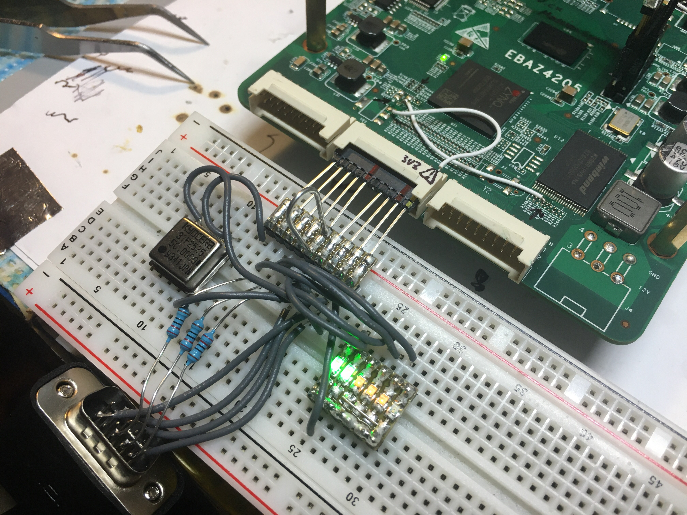
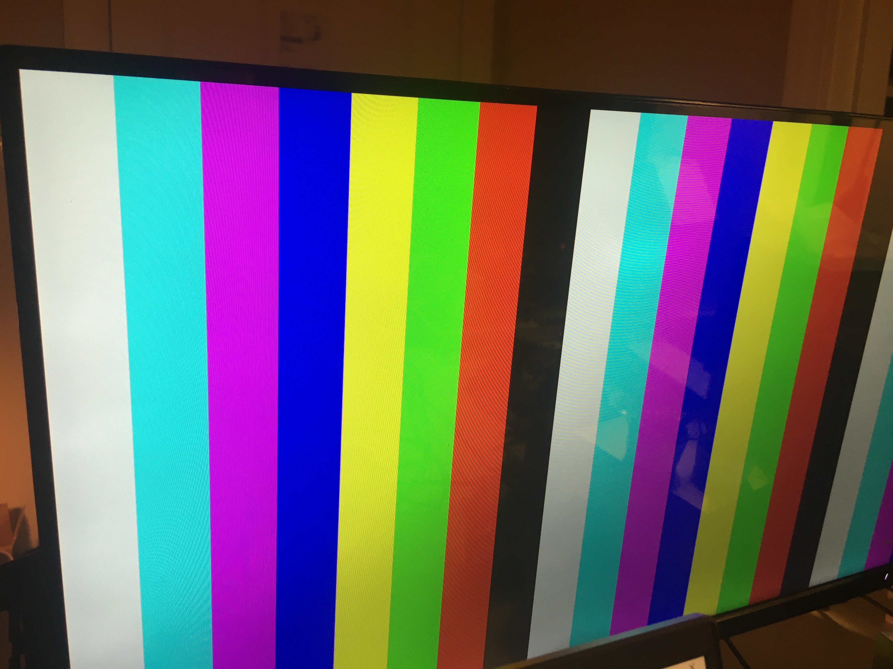

# videowavy

Bare bones VGA signal generation proof of concept using EBAZ4205 board with Xilinx Vivado. This only use the PL section of the chip

This is my first attempt at HDL - don't except anything fancy

Errata: The vertical active zone thing doesn't quite work yet. Horizontal works fine. 
Todo: Potentially do something with image buffer and rendering stuff 

 

# License
This work is licensed under a [Creative Commons Attribution-NonCommercial-ShareAlike 4.0 International License][cc-by-nc-sa].

[cc-by-nc-sa]: http://creativecommons.org/licenses/by-nc-sa/4.0/
